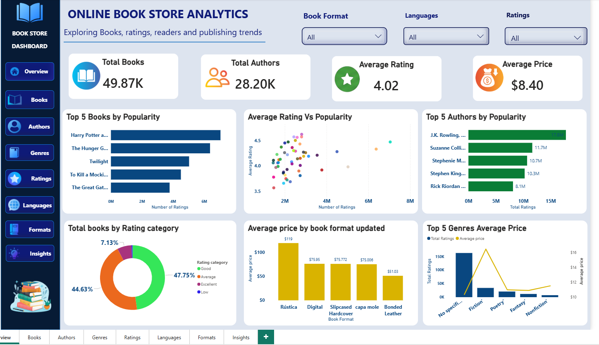
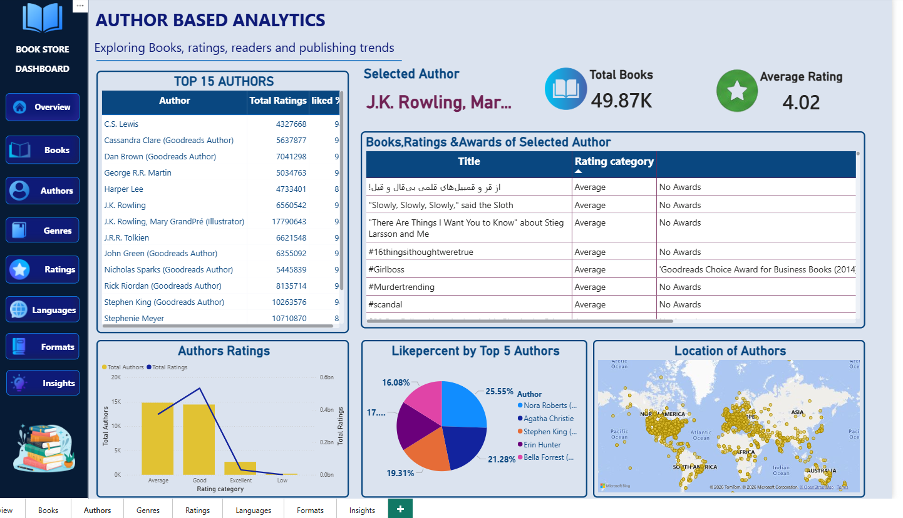
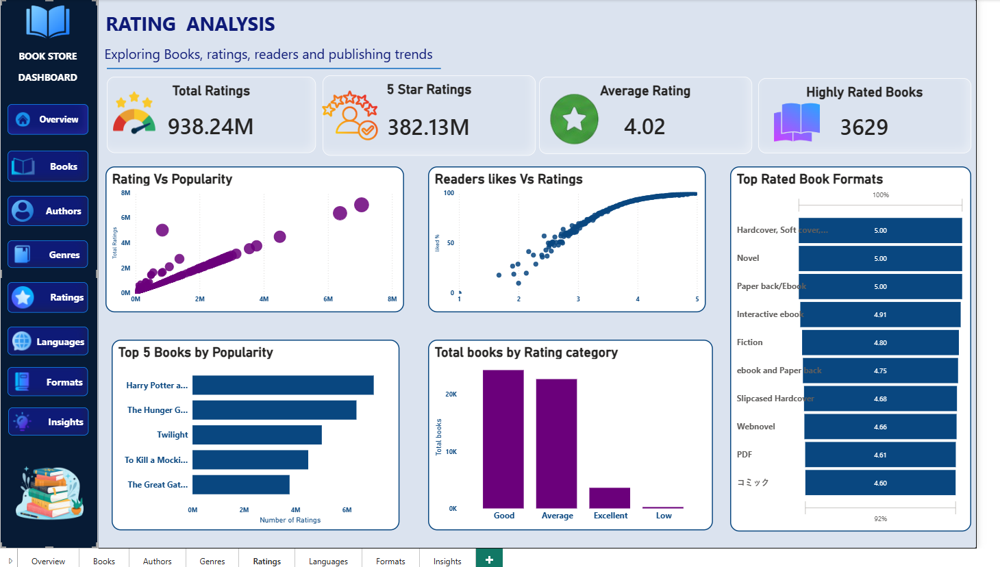
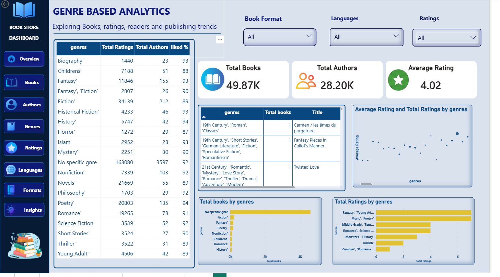
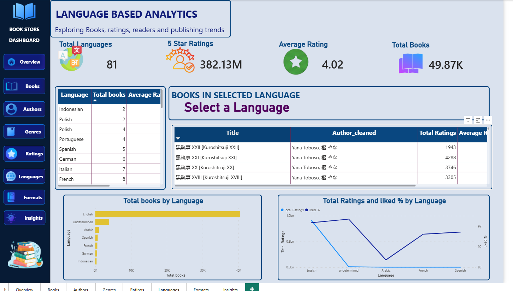
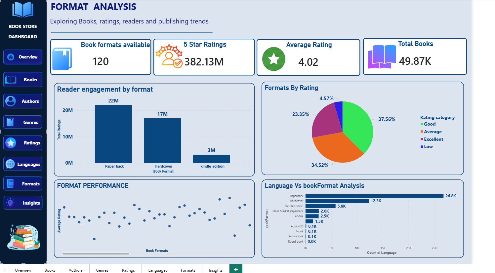
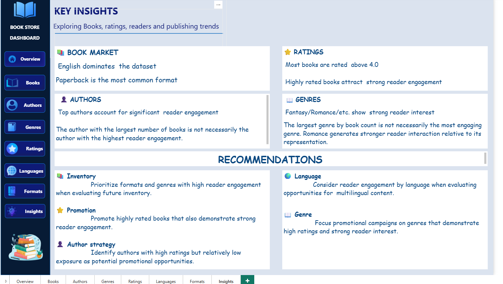

# Dash Board Images

# Online Bookstore Data Analysis
##Project Overview

This project presents an interactive Online Book Store Analytics Dashboard developed using Excel and Power BI. The dataset was systematically cleaned and transformed in Excel, including data-quality checks, handling missing values, standardizing text and formats, and preparing key analytical fields. Power BI was then used to build an interactive dashboard covering overall book performance, author analysis, genre trends, ratings, languages, book formats, series, and key KPIs. Interactive filters and drill-down features enable users to explore individual authors, genres, and books and identify meaningful patterns in the dataset. The project demonstrates an end-to-end data cleaning, analysis, visualization, and business-insight workflow using Excel and Power BI.

Tools
1. Excel
2. Power BI
3. Power Query
4. DAX

 #Project workflow
 
   Raw Dataset
     
Excel Data Cleaning
     
Power Query
     
Data Transformation
     
Power BI Data Model
     
DAX Measures
     
Interactive Dashboard
     
Business Insights
